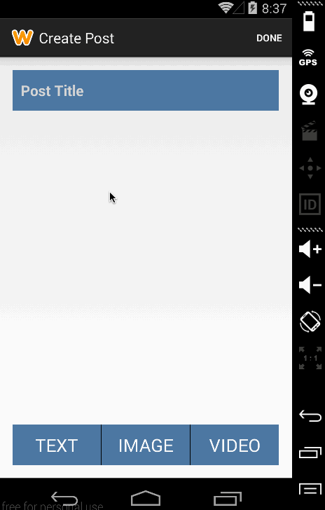
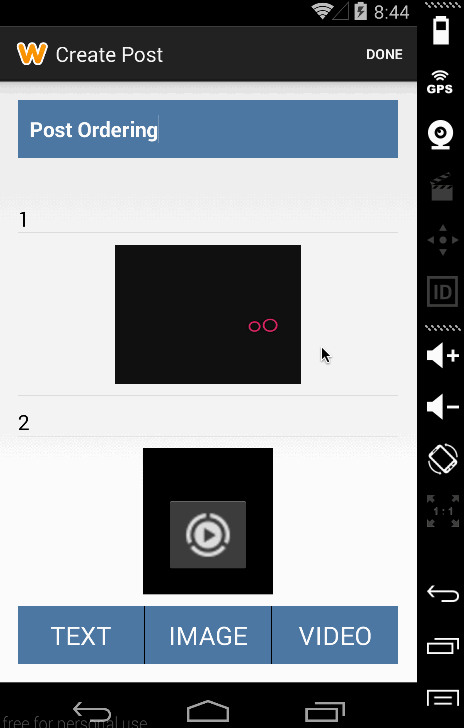

Simple Android Blog App

Libraries used:
https://github.com/bauerca/drag-sort-listview

Functionalities:
- Adding blog post
  - adding/editing/deleting text fields
  - adding/editing/deleting pictures
  - adding/editing/deleting videos
- Reordering items in blog posts with drag/drop feature

Data is persisted with SQLite.

